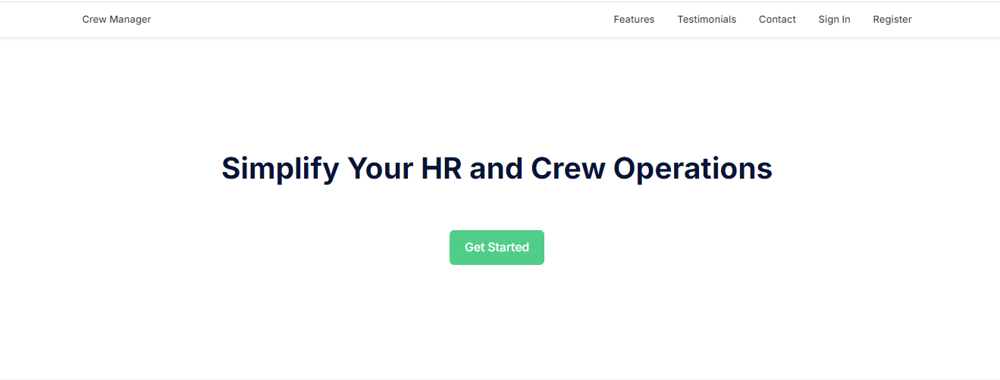
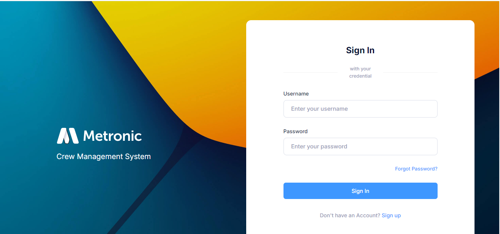
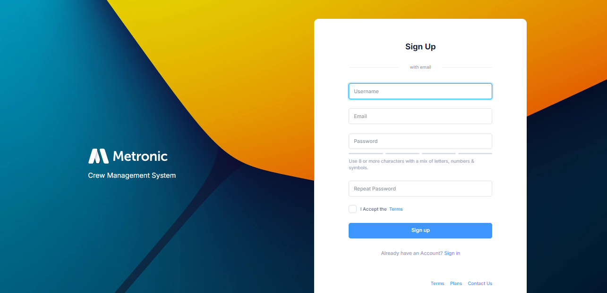
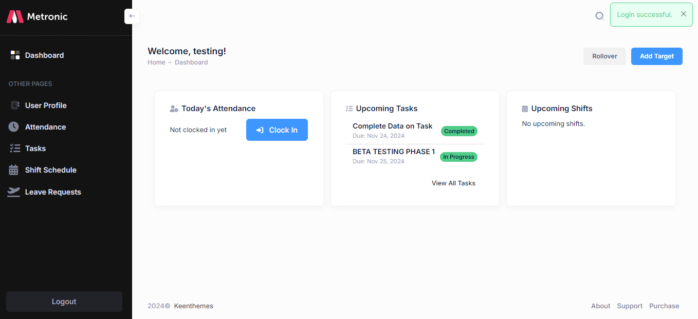
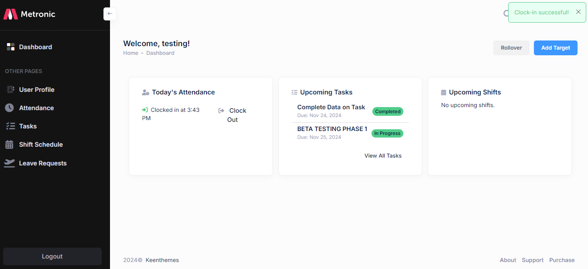
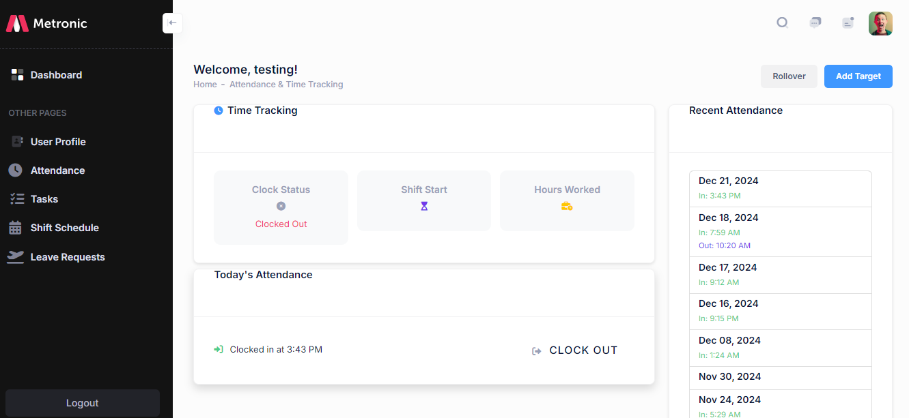
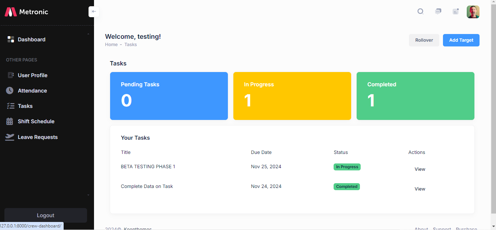
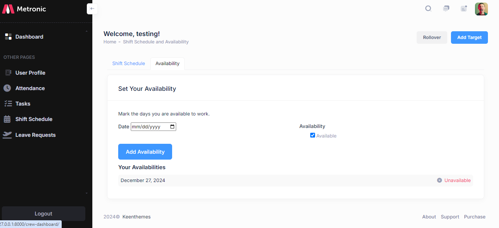
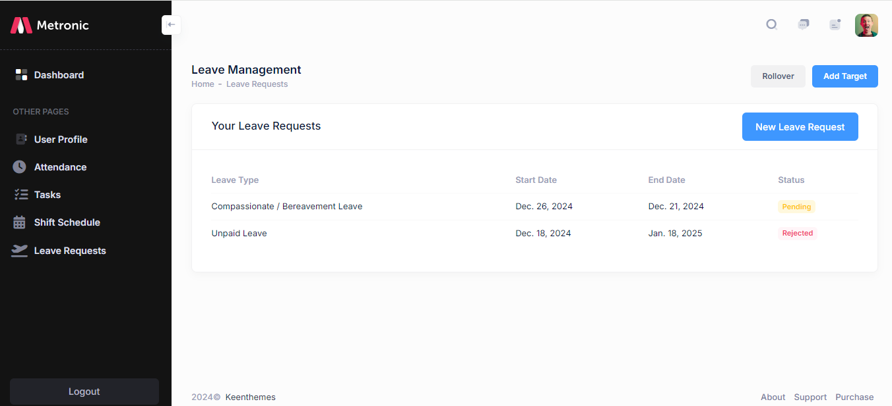
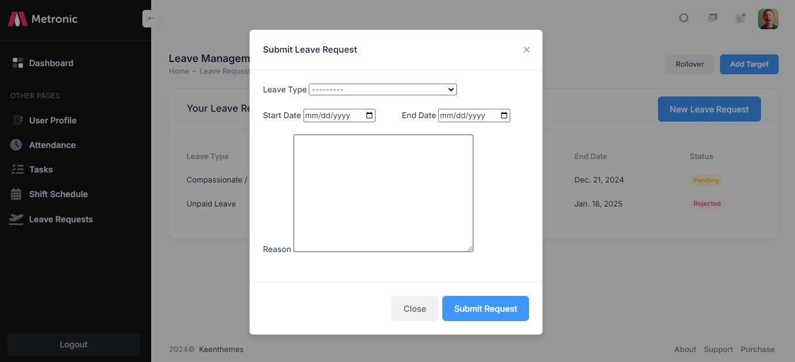

# Crew Management System Created Using Django
This is a Comprehensive Crew Management System Developed for Streamlining HR and Crew Operations.
Feel free to customize it based on your specific needs.

[Front-end Template](https://preview.keenthemes.com/metronic8/demo23/index.html "Admin Metronic")

If you find this project helpful, don't forget to ADD a STAR ⭐️  to this repository! 👆

## Features of this Project

### A. HR/Admin Users Can:
1. View Overall Summary Charts for Crew Performance, Recruitment, Attendance, Leave Requests, and Payroll.
2. Manage Crew Members (Add, Update, and Remove).
3. Manage Departments and Positions.
4. Approve or Reject Recruitment Applications.
5. Track Crew Attendance.
6. Assign Shifts and Tasks to Crew Members.
7. Review and Approve Leave Requests.
8. Evaluate Crew Performance.
9. Make Announcements to All or Specific Departments.

### B. Crew Members Can:
1. View Dashboard with Summary Charts for Tasks, Attendance, and Announcements.
2. Clock In/Out for Attendance.
3. View Assigned Tasks and Shift Schedules.
4. Apply for Leave and View Status.
5. Submit Feedback or Concerns to HR.
6. Access Payroll Details.

### C. New Recruits Can:
1. Register and Create an Account.
2. Upload Necessary Documents for Verification.
3. Track Recruitment Application Status.

## 📸 Screenshots
<!-- Landing Page -->
- Landing Page


<!-- Sign-In Page -->
- Sign-In Page


<!-- Sign-Up Page -->
- Sign-Up Page


<!-- Crew Dashboard -->
- Crew Dashboard


<!-- Clock-In Successful -->
- Clock-In Successful


<!-- Attendance Page -->
- Attendance Page


<!-- Task Page -->
- Task Page


<!-- Shift Schedule Page -->
- Shift Schedule Page


<!-- Leave Management Page -->
-  Leave Management Page 


<!-- Leave Request Page -->
- Leave Request Page 


## Support the Developer
1. Add a Star 🌟  to this Repository.
2. Follow on Twitter/Github.


## How to Install and Run this Project

### Pre-Requisites
1. Install Git Version Control:
   [ https://git-scm.com/ ]

2. Install Python Latest Version:
   [ https://www.python.org/downloads/ ]

3. Install Pip (Package Manager):
   [ https://pip.pypa.io/en/stable/installing/ ]

### Installation Steps
**1. Create a Folder where you want to save the project.**

**2. Create and Activate a Virtual Environment.**

Install Virtual Environment:
```
$ pip install virtualenv
```

Create Virtual Environment:
- **Windows**:
  ```
  $ python -m venv venv
  ```
- **Mac**:
  ```
  $ python3 -m venv venv
  ```
- **Linux**:
  ```
  $ virtualenv .
  ```

Activate Virtual Environment:
- **Windows**:
  ```
  $ source venv/scripts/activate
  ```
- **Mac/Linux**:
  ```
  $ source venv/bin/activate
  ```

**3. Clone this Project:**
```
$ git clone https://github.com/arakunle22/CrewMgt-V2
```

Navigate to the Project Directory:
```
$ cd crew_management
```

**4. Run the Server:**

- **Windows**:
  ```python
  $ python manage.py runserver
  ```
- **Mac/Linux**:
  ```python
  $ python3 manage.py runserver
  ```

**5. Create a Superuser (Admin):**

- **Windows**:
  ```
  $ python manage.py createsuperuser
  ```
- **Mac/Linux**:
  ```
  $ python3 manage.py createsuperuser
  ```

Enter an Email and Password for the Admin Account.

**Default Admin Credentials:**
- Email: admin@admin.com
- Password: admin

## For Sponsorship or Project Enquiries
1. Email - peacearakunle@gmail.com
2. LinkedIn - [arakunle-peace](https://www.linkedin.com/in/arakunle-peace/ "Arakunle Peace on LinkedIn")
3. Twitter - [peace_xam](https://x.com/peace_xam "Arakunle Peace on Twitter")

## Project Milestones
- [x] Crew/Admin Login
- [x] Add and Edit Crew Members
- [x] Add and Edit Departments/Positions
- [x] Upload Crew Documents
- [x] Assign Tasks and Shifts
- [x] Attendance Tracking
- [x] Leave Management
- [x] Payroll Processing
- [x] Recruitment Application Review
- [x] Password Reset via Email
- [x] Feedback and Announcements
- [x] Dashboard for Admin and Crew
- [x] Dynamic Links and Navigation

## Questions and Challenges During Development
- https://stackoverflow.com/questions/63829896/is-there-a-specific-way-of-adding-apps-in-django/

## Helpful Resources
- https://simpleisbetterthancomplex.com/tutorial/2018/01/18/how-to-implement-multiple-user-types-with-django.html
- https://stackoverflow.com/questions/29416478/change-form-field-value-before-saving
- https://www.fomfus.com/articles/how-to-use-email-as-username-for-django-authentication-removing-the-username

